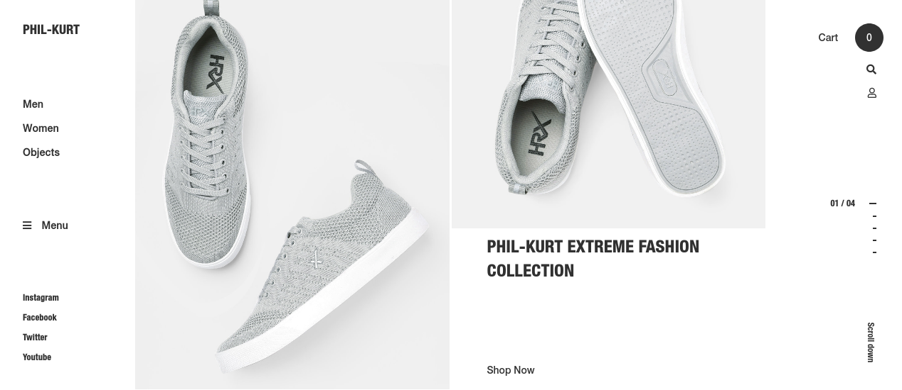
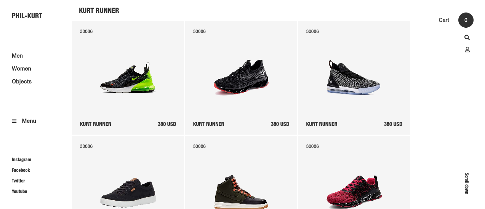
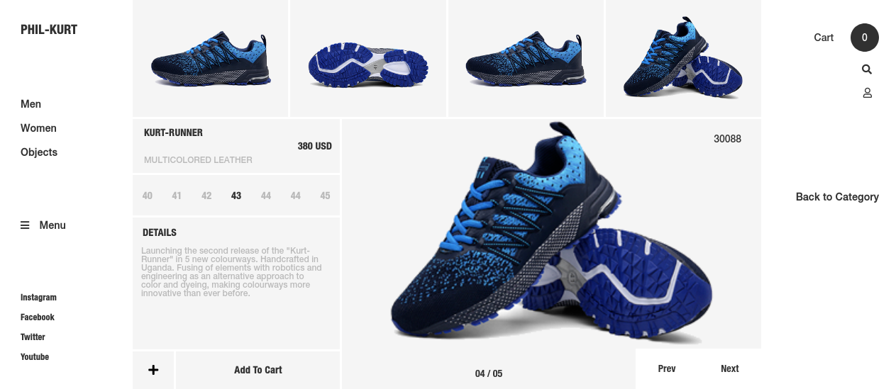
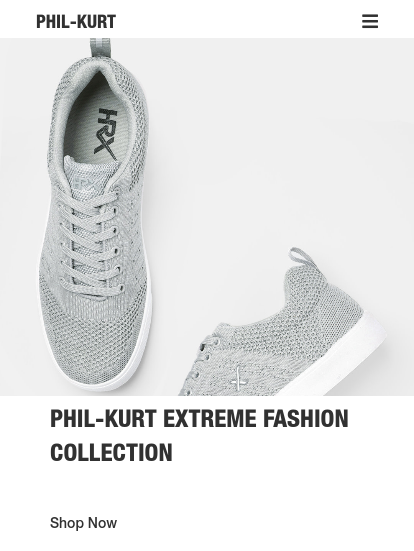
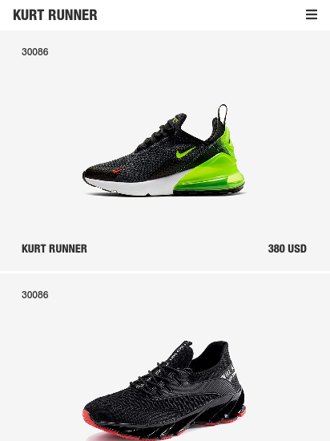
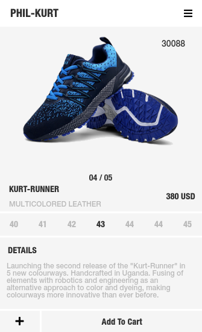
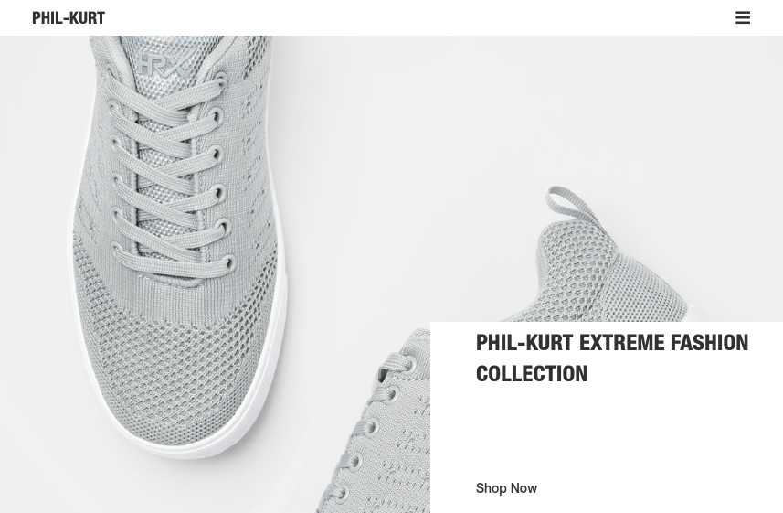
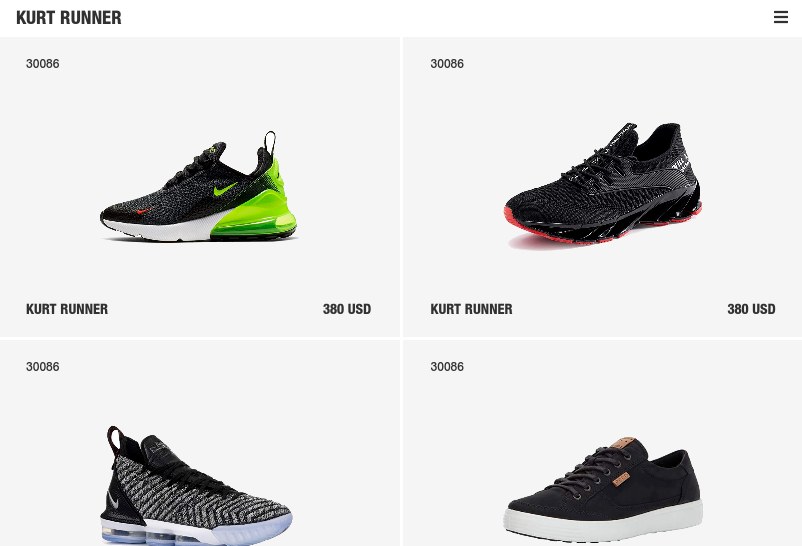
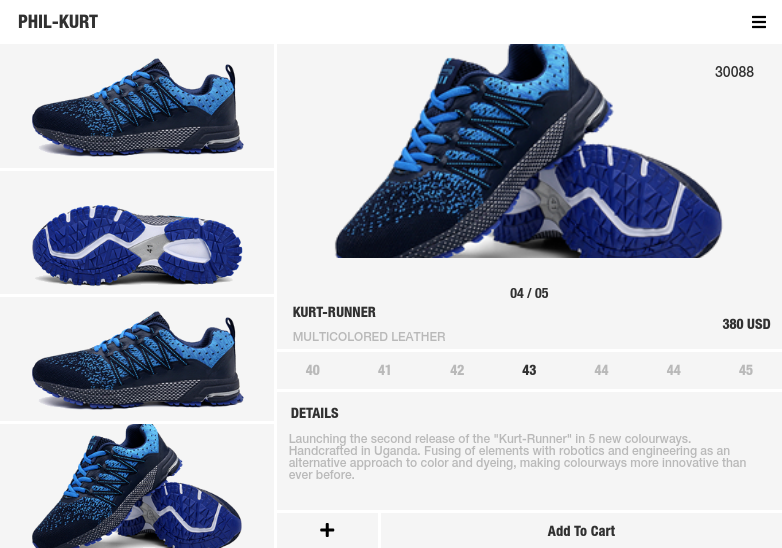

# HTML & CSS capstone project: Sneakers shop
A Capstone project is a solo projects at the end of the each of the [Microverse](https://www.microverse.org/) Main Technical Curriculum sections.

This project inparticular is a real-world-like project, built with real world business specifications. Its based on an online shop for sneakers.
 
 
## Screenshots for various screen sizes
 

   

 

 

 
 

 &nbsp;  &nbsp; &nbsp; 
 

 

In this project, my aim was to build just the appearance of the website and **NOT** to give it functionality.

## Built with
  * HTML
  * SASS (SCSS)

## Live demo
[Live Demo Link](https://raw.githack.com/PhillipUg/sneaker-shop/sneaker-shop/index.html)

## Author

 :bust_in_silhouette:
 * Github: https://github.com/PhillipUg
 * Twitter: https://twitter.com/Phillip_Ug
 * LinkedIn: https://www.linkedin.com/in/phillip-musiime-74657019a/

## Contributing
Contributions, issues and feature requests are welcome!

   1. Fork the Project
   2. Create your Feature Branch (git checkout -b feature/AmazingFeature)
   3. Commit your Changes (git commit -m 'Add some AmazingFeature')
   4. Push to the Branch (git push origin feature/AmazingFeature)
   5. Open a Pull Request

Feel free to check the [issues page](https://github.com/PhillipUg/sneaker-shop/issues).

## Show your support
Give a :star: if you like this project!

## Acknowledgements
  * [Microverse](https://www.microverse.org/)
  
## License
 Distributed under the MIT License.
